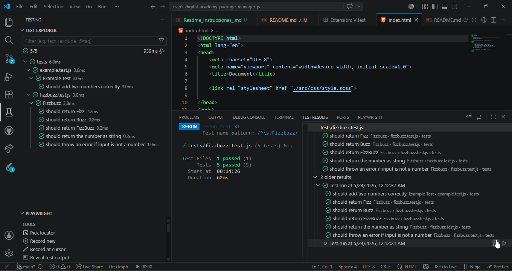

¡Excelente idea! Un buen archivo README.md es la carta de presentación de tu proyecto. El profesor verá que documentaste tus requisitos, explicaste cómo correr los tests y dejaste todo estructurado como una profesional.

Aquí tienes el texto completo en formato Markdown. Copia todo el bloque gris de abajo y pégalo directamente dentro de tu archivo Readme.md en la raíz del proyecto:

Markdown
# 🎮 FizzBuzz Game - Package Manager Challenge

¡Bienvenido al reto FizzBuzz! Este proyecto implementa el clásico juego de lógica matemática utilizando **JavaScript (Node.js)** y una arquitectura de desarrollo basada en **Pruebas Unitarias (TDD)** con la herramienta **Vitest**.

## 📖 El Reto: Escenario Escolar
Imagina la escena: tienes once años y tu profesor de matemáticas decide "hacerlo divertido" con un juego. Cada alumno debe decir el siguiente número en la secuencia empezando por el uno siguiendo estas reglas:
* Si el número es divisible por 3, dices **“Fizz”**.
* Si es divisible por 5, dices **“Buzz”**.
* Si es divisible por 3 y 5, dices **“FizzBuzz”**.
* Si no es divisible por ninguno, dices el número.
* Si el dato no es un número, se debe lanzar un error controlado.

---

## 🛠️ Tecnologías Utilizadas
* **JavaScript (ES6+):** Lenguaje principal para el desarrollo de la lógica.
* **Vitest:** Framework de pruebas moderno, rápido y nativo para proyectos Vite/Node.
* **NPM:** Gestor de paquetes para controlar las dependencias de desarrollo.

---

## 📂 Estructura del Proyecto
```text
├── src/
│   └── js/
│       └── fizzbuzz.js      # Lógica principal (Función checkNumber)
├── tests/
│   ├── example.test.js
│   └── fizzbuzz.test.js   # Batería de 5 escenarios automatizados
├── package.json           # Configuración y scripts del proyecto
└── Readme.md              # Documentación del proyecto
```
## 📸 Evidencia de Pruebas Exitosas


## 👨‍💻 Autora

Proyecto desarrollado por:
* **Luisa María Cortés**

Training Developer · F5 Bootcamp